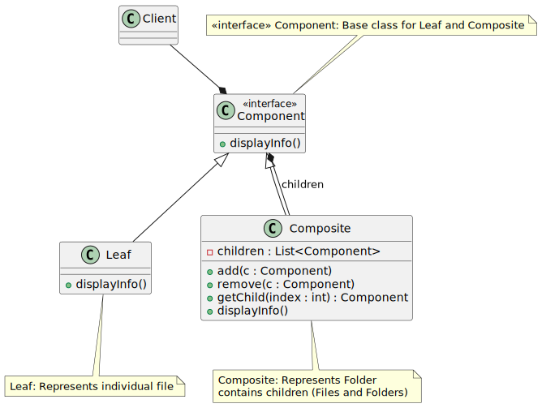
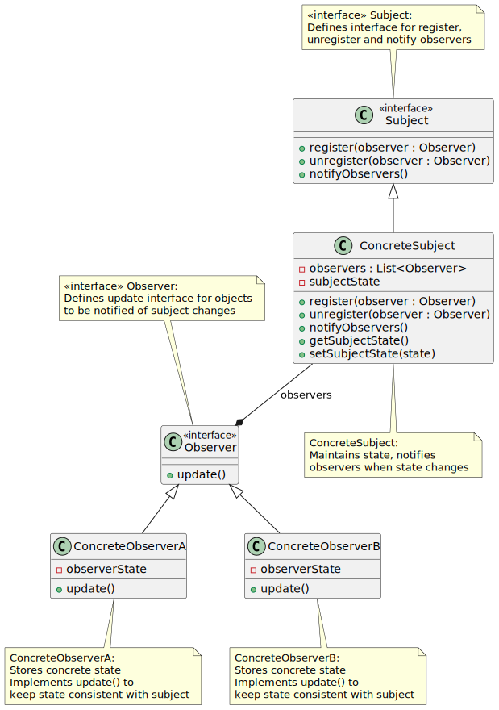
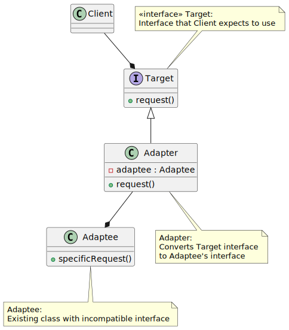

# Software Architecture Practice Exercises - Week 5

## Submission Information

- **Full Name**: Dương Hoàng Lan Anh
- **Student ID**: 21087481

---

## A> Design Patterns Application - Week 5:

### Exercise 1: File and folder management system

**Bài toán**: Xây dựng hệ thống quản lý thư mục và tập tin theo mô hình cây, với các yêu cầu:

- Thư mục có thể chứa nhiều tập tin hoặc thư mục con.
- Tập tin chỉ chứa dữ liệu, không chứa thư mục/tập tin khác.
- Cả thư mục và tập tin đều có thể được hiển thị thông tin.

**Sơ đồ UML:**

**Giải thích về lựa chọn Design Pattern (Composite Pattern) cho bài toán này:**

- **Biểu diễn cấu trúc cây**: Composite Pattern sinh ra để biểu diễn cấu trúc cây (part-whole hierarchy), chính xác như mô hình thư mục và tập tin. Thư mục đóng vai trò là "Composite" (nút cha), tập tin đóng vai trò là "Leaf" (nút lá), và cả hai cùng thuộc chung một "Component" (đối tượng chung).
- **Xử lý thống nhất**: Composite Pattern cho phép bạn xử lý các đối tượng đơn lẻ (tập tin) và các đối tượng phức hợp (thư mục) một cách thống nhất thông qua interface chung (Component). Client code không cần phân biệt đang làm việc với tập tin hay thư mục.
- **Thêm thao tác chung**: Chúng ta có thể định nghĩa các thao tác chung (ví dụ: hiển thị thông tin, tính kích thước,...) trên Component interface và các thao tác này sẽ được thực hiện trên cả tập tin và thư mục một cách tự nhiên.
- **Cung cấp tính năng mở rộng**: Composite Pattern giúp dễ dàng thêm các loại đối tượng mới vào trong cấu trúc mà không cần thay đổi mã hiện tại, giúp duy trì nguyên tắc mở/đóng (Open/Closed Principle) trong thiết kế.

**Kết quả:**

**Kết luận:**

Composite Pattern giúp chúng ta thiết kế hệ thống quản lý thư mục và tập tin một cách hiệu quả, dễ mở rộng và bảo trì. Nó thể hiện rõ sức mạnh trong việc xử lý các cấu trúc dữ liệu phân cấp và phức tạp.

---

### Exercise 2: Stock/job status change notification system

**Bài toán**: Hệ thống cần thông báo cho các nhà đầu tư/thành viên nhóm khi có thay đổi giá cổ phiếu/trạng thái công việc.

**Sơ đồ UML:**

**Giải thích về lựa chọn Design Pattern (Observer Pattern) cho bài toán này:**

- **Mô hình Publish-Subscribe**: Observer Pattern thể hiện mô hình "publish-subscribe", trong đó "Subject" (Cổ phiếu/Công việc) phát ra thông báo (publish) khi có thay đổi, và các "Observers" (Nhà đầu tư/Thành viên nhóm) đăng ký (subscribe) để nhận thông báo.
- **Loose Coupling (Giảm liên kết)**: Subject không cần biết chi tiết về Observers, chỉ cần thông báo "có sự thay đổi" là đủ. Các Observer tự quyết định phản ứng của mình khi nhận được thông báo. Điều này giảm sự phụ thuộc giữa các component, tăng tính mềm dẻo.
- **Mở rộng Observer dễ dàng**: Thêm Observer mới (nhà đầu tư mới, thành viên mới) rất đơn giản, không ảnh hưởng đến Subject hoặc các Observer khác.

**Kết quả:**

**Kết luận:**
Observer Pattern giúp chúng ta xây dựng hệ thống theo mô hình "publish-subscribe" một cách linh hoạt và dễ mở rộng. Nó giúp giảm sự phụ thuộc giữa các component, tăng tính linh hoạt và dễ bảo trì.

---

### Exercise 3: Convert XML data format to JSON and vice versa

**Bài toán**: Dịch vụ web yêu cầu JSON, hệ thống khác chỉ hỗ trợ XML. Viết adapter để chuyển đổi XML <-> JSON.

**Sơ đồ UML:**

**Giải thích về lựa chọn Design Pattern (Adapter Pattern) cho bài toán này:**

- **Giải quyết interface không tương thích**: Adapter Pattern giúp hai interface không tương thích (JSON service vs XML system) có thể làm việc cùng nhau bằng cách tạo ra một "adapter" trung gian chuyển đổi dữ liệu qua lại giữa hai bên.
- **Re sử dụng code**: Thay vì viết lại hệ thống XML để hiểu JSON, hoặc ngược lại, Adapter cho phép tận dụng code hiện có của cả hai hệ thống, chỉ cần thêm lớp adapter để "dịch" dữ liệu.
- **Tính linh hoạt và mở rộng**: Khi có thêm định dạng dữ liệu mới cần hỗ trợ (ví dụ: CSV, YAML), bạn có thể tạo thêm các Adapter mới mà không cần sửa đổi core logic của hệ thống hiện tại.

**Kết quả:**

**Kết luận:**
Adapter Pattern là một giải pháp hữu ích khi bạn cần tích hợp các component hoặc hệ thống có interface khác nhau. Nó giúp hệ thống trở nên linh hoạt hơn và tái sử dụng được các module code hiện có.
