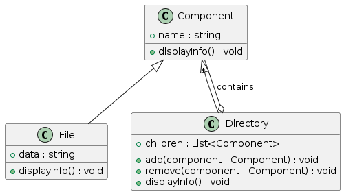
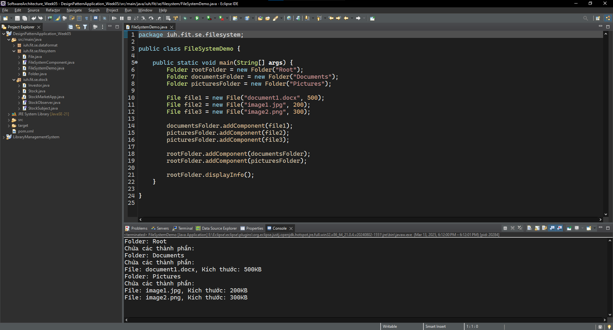
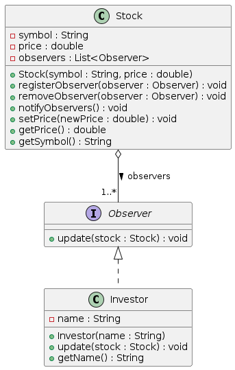
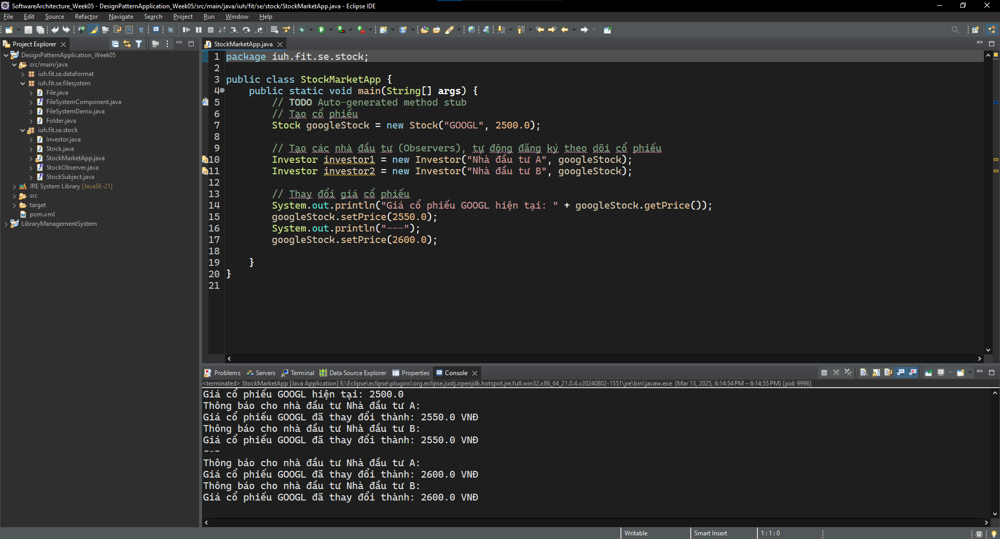
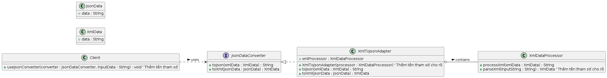
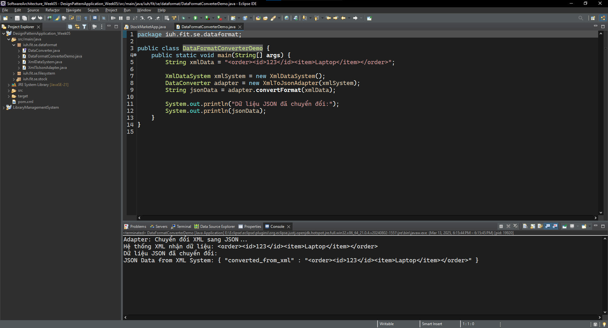
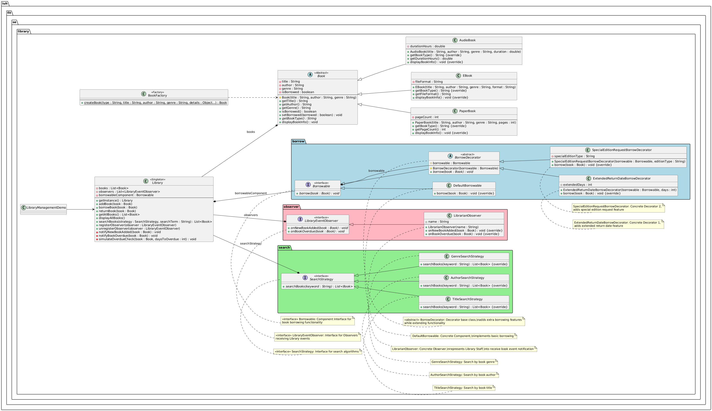

# Software Architecture Practice Exercises - Week 5

## Submission Information

- **Full Name**: Dương Hoàng Lan Anh
- **Student ID**: 21087481

---

## A> Design Patterns Application - Week 5:

### Exercise 1: File and folder management system

**Bài toán**: Xây dựng hệ thống quản lý thư mục và tập tin theo mô hình cây, với các yêu cầu:

- Thư mục có thể chứa nhiều tập tin hoặc thư mục con.
- Tập tin chỉ chứa dữ liệu, không chứa thư mục/tập tin khác.
- Cả thư mục và tập tin đều có thể được hiển thị thông tin.

**Class Diagram:**

**Code execution results:**

---

### Exercise 2: Stock/job status change notification system

**Bài toán**: Hệ thống cần thông báo cho các nhà đầu tư/thành viên nhóm khi có thay đổi giá cổ phiếu/trạng thái công việc.

**Class Diagram:**

**Code execution results:**

---

### Exercise 3: Convert XML data format to JSON and vice versa

**Bài toán**: Dịch vụ web yêu cầu JSON, hệ thống khác chỉ hỗ trợ XML. Viết adapter để chuyển đổi XML <-> JSON.

**Class Diagram:**

**Code execution results:**

---

## B> Extra Exercise: Library Management System using Design Patterns

**Class Diagram:**

