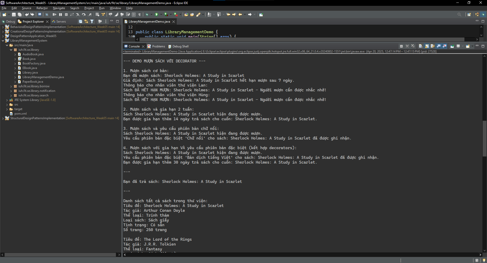

# Software Architecture Practice Exercises - Week 5

## Submission Information

- **Full Name**: Dương Hoàng Lan Anh
- **Student ID**: 21087481

---

## A> Design Patterns Application - Week 5:

### Exercise 1: File and folder management system

**Bài toán**: Xây dựng hệ thống quản lý thư mục và tập tin theo mô hình cây, với các yêu cầu:

- Thư mục có thể chứa nhiều tập tin hoặc thư mục con.
- Tập tin chỉ chứa dữ liệu, không chứa thư mục/tập tin khác.
- Cả thư mục và tập tin đều có thể được hiển thị thông tin.

**Class Diagram:**

**Code execution results:**

---

### Exercise 2: UI Components

**Bài toán**:
Trong một giao diện người dùng, các thành phần như nút bấm, các hộp thoại, thanh điều hướng có thể là các phần tử riêng biệt hoặc nhóm lại thành các phần tử phức tạp hơn.
Composite Design Pattern có thể giúp bạn tổ chức các phần tử UI này vào các nhóm hợp lý mà không cần phải thay đổi cách thức hoạt động của chúng.

Hãy áp dụng Composite Design Pattern để giải bài toán trên.

Yêu cầu:
  - Vẽ Class Diagram mô phỏng bài toán trên
  - Sử dụng ngôn ngữ Java để cài đặt mô phỏng bài toán trên

**Class Diagram:**

**Code execution results:**

---

### Exercise 3: Stock Market

**Bài toán**:
Khi giá của một cổ phiếu thay đổi, các nhà đầu tư đã đăng ký để theo dõi cổ phiếu đó sẽ nhận thông báo ngay lập tức về sự thay đổi.
Trong một dự án phần mềm, khi có sự thay đổi về tình trạng hoặc trạng thái công việc (task), các thành viên trong nhóm sẽ nhận được thông báo tự động để theo dõi tiến độ.

**Class Diagram:**

**Code execution results:**

---

### Exercise 4: Task Management

**Bài toán**:
Trong một dự án phần mềm, khi có sự thay đổi về tình trạng hoặc trạng thái công việc (task), các thành viên trong nhóm sẽ nhận được thông báo tự động để theo dõi tiến độ.

**Class Diagram:**

**Code execution results:**

---

### Exercise 5: Data Format Converter

**Bài toán**:
Một dịch vụ web yêu cầu đầu vào ở định dạng JSON, nhưng một hệ thống khác chỉ hỗ trợ XML. Bạn có thể viết một adapter để chuyển đổi dữ liệu từ XML sang JSON và ngược lại.

Hãy áp dụng Observer Design Pattern vào các trường hợp trên

Yêu cầu:
  - Vẽ Class Diagram mô phỏng bài toán trên
  - Sử dụng ngôn ngữ Java để cài đặt mô phỏng bài toán trên

**Class Diagram:**

**Code execution results:**

---

## B> Extra Exercise: Library Management System using Design Patterns

**Code execution results:**

